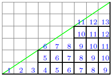

The Extended Catalan Numbers
---
### Definition 
Consider the enumeration of lattice paths in 2D plane with steps *E*=(1,0) and *N*=(0,1).</br>
Let  
denote **the extended Catalan numbers** which equals the number of lattice paths staying weakly below 
.

For example,  equals 
the number of lattice paths from (0,0) to (9,6) with the possible paths as shown in bold lines of the following figure:



Let  
denote the generating function for the extended Catalan numbers.

We present three equations.

### The Catalan Kernel  
Let 
denote **the Catalan kernel** which is the primitve root of the equation 
.

Using the function `CatalanKernel` in `staircase.cpp`, one can compute the Catalan kernels by
```
unsigned int k, l;
FormalPowerSeries<Rational<Long> > K_kl = CatalanKernel(k, l); 
std::cout << K << "\n";
```

### Relation between the extended Catalan numbers and the Catalan kernel  

.

Using the function `ExtendedCatalan` in `staircase.cpp`, one can compute the generating function for the extended Catalan numbers derived from the Catalan kernel as:
```
unsigned int k, l, m;
FormalPowerSeries<Rational<Long> > C_kl = ExtendedCatalan(K_kl, 1, l); 
FormalPowerSeries<Rational<Long> > C_mkml = ExtendedCatalan(K_kl, 1, m*l); 
std::cout << C_kl << "\n";
```

### Relation between the extended Catalan numbers and the simple Catalan numbers  

.

Using the function `ExtendedCatalan` in `staircase.cpp`, one can compute the generating function for the extended Catalan numbers derived from from the simple Catalan numbers as: 
```
unsigned int k, l, m;
FormalPowerSeries<Rational<Long> > C_mCkl = ExtendedCatalan(C_kl, l, m);
std::cout << C_mCkl << "\n";
```
